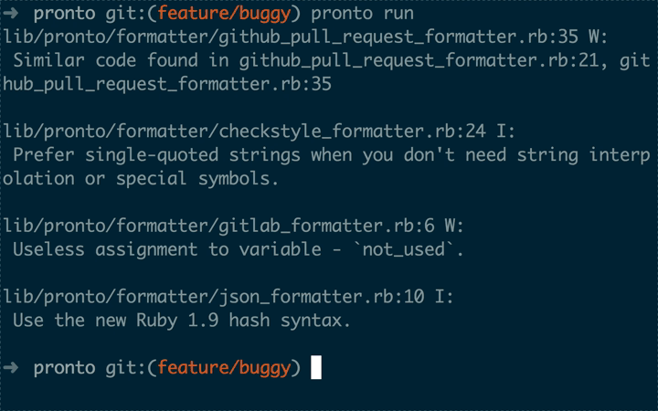

# Pronto

[](https://codeclimate.com/github/mmozuras/pronto)
[](http://travis-ci.org/mmozuras/pronto)
[](http://badge.fury.io/rb/pronto)
[](https://gemnasium.com/mmozuras/pronto)
[](http://inch-ci.org/github/mmozuras/pronto)

Pronto runs analysis quickly by checking only the relevant changes. Created to
be used on pull requests, but also suited for other scenarios. Perfect if you
want to find out quickly if branch introduces changes that conform to your
[styleguide](https://github.com/mmozuras/pronto-rubocop), [are DRY](https://github.com/mmozuras/pronto-flay), [don't introduce security holes](https://github.com/mmozuras/pronto-brakeman) and [more](#runners).



## Usage

Pronto runs the checks on a diff between the current HEAD and the provided commit-ish (default is master).

### GitHub Integration

You can run Pronto as a step of your CI builds and get the results as comments
on GitHub commits using `GithubFormatter` or `GithubPullRequestFormatter`.

Add Pronto runners you want to use to your Gemfile:
```ruby
gem 'pronto-rubocop'
```
or gemspec file:
```ruby
s.add_development_dependency 'pronto-rubocop'
```
Set the GITHUB_ACCESS_TOKEN environment variable to [OAuth token](https://help.github.com/articles/creating-an-access-token-for-command-line-use)
that has access to the repository.

Then just run it:
```bash
GITHUB_ACCESS_TOKEN=token pronto run -f github -c origin/master
```
or, if you want comments to appear on pull request diff, instead of commit:
```bash
GITHUB_ACCESS_TOKEN=token PULL_REQUEST_ID=id pronto run -f github_pr -c origin/master
```

As an alternative, you can also set up a rake task:
```ruby
Pronto.gem_names.each { |gem_name| require "pronto/#{gem_name}" }

formatter = Pronto::Formatter::GithubFormatter.new # or GithubPullRequestFormatter
Pronto.run('origin/master', '.', formatter)
```

### Local Changes

You can run Pronto locally. First, install Pronto and the runners you want to use:
```bash
gem install pronto
gem install pronto-rubocop
```
Then navigate to the repository you want to run Pronto on, and:
```bash
git checkout feature/branch
pronto run # Pronto runs against master by default
```

Just run `pronto` without any arguments to see what Pronto is capable off.

## Runners

Pronto can run various tools and libraries, as long as there's a runner for it.
Currently available:

* [pronto-rubocop](https://github.com/mmozuras/pronto-rubocop)
* [pronto-flay](https://github.com/mmozuras/pronto-flay)
* [pronto-brakeman](https://github.com/mmozuras/pronto-brakeman)
* [pronto-foodcritic](https://github.com/mmozuras/pronto-foodcritic)
* [pronto-rails_best_practices](https://github.com/mmozuras/pronto-rails_best_practices)
* [pronto-reek](https://github.com/mmozuras/pronto-reek)
* [pronto-poper](https://github.com/mmozuras/pronto-poper)
* [pronto-jshint](https://github.com/mmozuras/pronto-jshint)
* [pronto-spell](https://github.com/mmozuras/pronto-spell)
* [pronto-haml](https://github.com/mmozuras/pronto-haml)
* [pronto-scss](https://github.com/mmozuras/pronto-scss)
